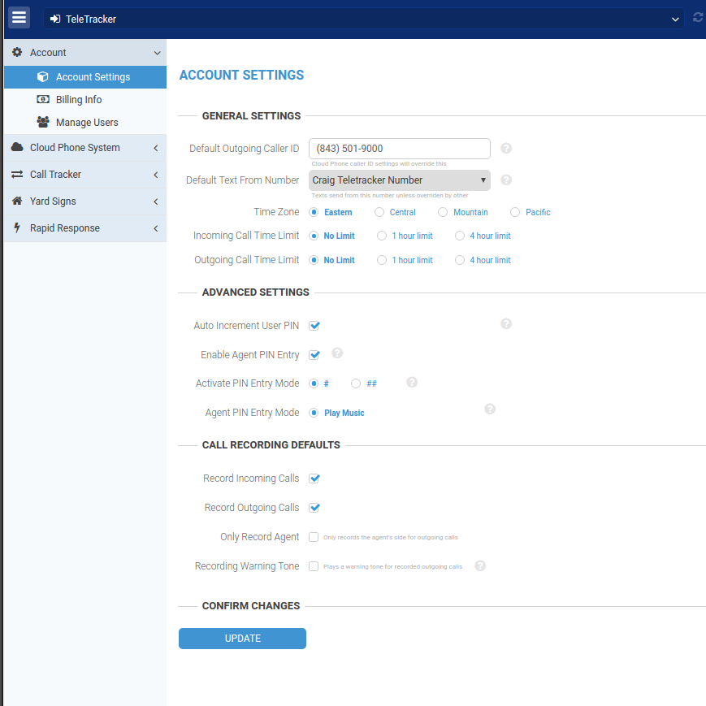
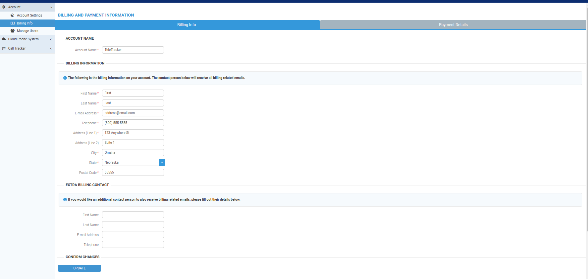
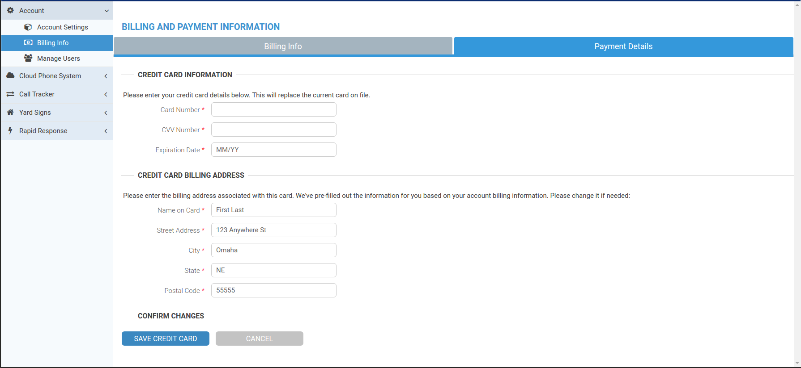
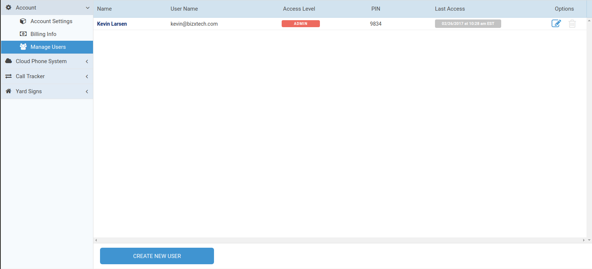
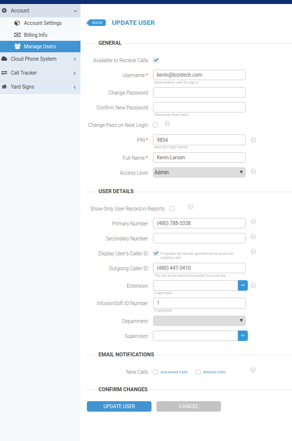

# TeleTracker Client Area User Documentation

This document provides instructions on how to use the TeleTracker Client Area, including explanations of what each module does. Each component and configuration option is explored in detail.

## Table of Contents

- [Home Screen](#home-screen)
- [Account Module](#account-module)
- [Cloud Phone System Module](#cloud-phone-system-module)
- [Call Tracker Module](#call-tracker-module)
- [Yard Signs Module](#yard-signs-module)
- [Rapid Response Module](#rapid-response-module)

## Home Screen

The Home Screen is composed of three main components:

* [Navigation Menu](#navigation-menu)
* [Account Switcher](#account-switcher)
* [Profile Menu](#profile-menu)

### Navigation Menu

The navigation menu on the left is composed of the toggle button (for showing and hiding the menu) and a list of modules. Each module is discussed in detail below. The modules that are displayed depend on the access level of the user as well as how the account is set up. For example, Yard Signs are not relevant for all accounts, and therefore the Yard Sign Module is not displayed for those accounts.

### Account Switcher

The account switcher is a drop down menu of all the accounts associated with the currently logged in user. If the user only has one account (as in the image above), only the one account is displayed. The refresh button to the right of the dropdown refreshes the available accounts.

### Profile Menu

The profile menu is a dropdown. The user's name is displayed, and if they have a TeleTracker number associated with their profile, that will be displayed as well. Currently, the only option in the dropdown is to log out. More options for personal settings coming soon!

## Account Module

The account module is only visible to users with access level "Manager" or "Admin". Managers can manage account settings and users, but only Admins have the ability to manage billing information. The following parts compose the account module:

* [Account Settings](#account-settings)
* [Billing Info](#billing-info)
* [Manage Users](#manage-users)

### Account Settings

The account settings page allows users to change account wide settings. 

| Name                       | Description |
| ----                       | :---------: |
| Default Outgoing Caller Id | If an outgoing call is made from the account, this is the number the person being called will see on their caller id. Must be a valid telephone number. Settings on the line making the outgoing call will override this. |
| Default Text From Number   | If an outgoing text is made from the account, this is the number the person receiving the text will see the text coming from. Must be a TeleTracker line. Settings in the Cloud Phone System module and Yard Signs module will override this. |
| Time Zone                  | Any times that are displayed throughout the app are based on this time zone. |
| Incoming Call Time Limit   | Incoming calls will be disconnected after the specified amount of time. |
| Outgoing Call Time Limit   | Outgoing calls will be disconnected after the specified amount of time. |
| Auto Increment User PIN    | When a new user is created, a PIN will be automatically generated. |
| Enable Agent PIN Entry     | If enabled, agents will be able to enter their PIN upon recieving a call, which will associate that call with their user in the Call Tracker module. |
| Activate PIN Entry Mode    | If Agent PIN Entry is enabled, the agents will have to enter `#` or `##` before entering their PIN. |
| Agent PIN Entry Mode       | If Agent PIN Entry is enabled, the caller will hear this while the agent is entering their PIN. |
| Record Incoming Calls      | Selecting this records incoming calls. Call recordings are accessible in the Call Tracker Module. |
| Record Outgoing Calls      | Selecting this records outgoing calls. |
| Only Record Agent          | Only record the agent's side of the conversation for outgoing calls. In some jurisdictions, this negates a requirement to inform the receiver of the call that the call is being recorded. |
| Recording Warning Tone     | This plays an automatic warning tone for outgoing calls. This complies with 47 CFR § 64.501(c) which states an automatic tone warning can be played at regular intervals for the purpose of informing the callers that the call is being recorded. Required if the agent or a recording does not explicitly inform the receiver of the call that the call is being recorded.  |
| Update Button              | The update button updates the server with the new values from the form. Changes are not saved unless this button is clicked. |

### Billing Info

The billing info page allows users to change their billing info. There are two tabs at the top: Billing info and Payment Details.

#### Billing Info Tab

The billing info tab allows users to update their information such as account name, address, etc.

| Name                       | Description                                                     |
| -------------------------- | :-------------------------------------------------------------: |
| Account Name               | Name of the account as showed in the account switcher dropdown. |
| First Name                 | First name of the account holder.                               |
| Last Name                  | Last name of the account holder.                                |
| E-mail Address             | E-mail address of the account holder.                           |
| Telephone                  | Contact phone number for account holder.                        |
| Address (Line 1)           | Street address of the account holder. Should be the billing address of credit card used for payment |
| Address (Line 2)           | Optional apartment/suite number                                 |
| City                       | City of account holder                                          |
| State                      | State of account holder. Currently only U.S. states and Canadian Provinces available |
| Postal Code                | Zip code of the account holder                                  |

There is also an additional contact form for another person to recieve billing related emails/phone calls.

#### Payment Details Tab

The payment details tab allows users to choose their payment method. If "Mail in Payment" is selected, the address to mail a check to is displayed. If "Credit Card" is chosen and the user has a card on file, the last four digits of the card are displayed. If there is no credit card on file, a form to submit credit card information is displayed.

| Name                       | Description                                                              |
| -------------------------- | :----------------------------------------------------------------------: |
| Card Number                | The credit card number to be charged.                                    |
| CVV Number                 | The cvv of the credit card to be charged.                                |
| Expiration Date            | The expiration date of the credit card to be charged.                    |
| Name on Card               | First and Last name of the credit card holder as it appears on the card. |
| Last Name                  | Last name of the account holder.                                         |
| E-mail Address             | E-mail address of the account holder.                                    |
| Telephone                  | Contact phone number for account holder.                                 |
| Street Address             | Street address of the credit card billing address.                       |
| City                       | City of credit card billing address.                                     |
| State                      | State of credit card billing address. U.S. state or Canadian province.   |
| Postal Code                | Zip code of credit card billing address.                                 |

### Manage Users

## Cloud Phone System Module

Lorem ipsum dolor sit amet, consectetur adipiscing elit. Pellentesque hendrerit facilisis dolor, sed convallis massa tincidunt nec. Praesent aliquam tortor in ipsum mattis, a iaculis metus blandit. Vestibulum et feugiat leo, at aliquet orci. Nullam consequat ante nulla, vel blandit orci dignissim ut. In quis dignissim ante, nec efficitur quam. Aenean neque lacus, efficitur ultricies nulla in, fermentum mollis enim. Mauris sed eros vel felis volutpat tempor. Aenean ornare urna quis massa mattis, eu porttitor neque feugiat. Aenean a risus a risus fringilla eleifend id ac urna. Duis non ante sit amet sem iaculis vulputate hendrerit a purus. Mauris ut quam a orci gravida feugiat. Donec sed malesuada leo. Curabitur tempus auctor lectus at finibus. Aenean ultrices suscipit sapien, in placerat arcu vestibulum vulputate.

Morbi ut imperdiet dolor. Cras convallis sapien augue, at facilisis tellus dictum eget. Pellentesque ut quam sollicitudin, bibendum leo ac, finibus est. Cras maximus neque arcu, nec efficitur ipsum luctus ac. Pellentesque auctor luctus risus, ut condimentum sem semper et. Aenean pulvinar urna dolor, commodo dignissim sem egestas id. Nulla facilisi. Nam facilisis et nunc a luctus. Cras et placerat diam.

Vestibulum ante ipsum primis in faucibus orci luctus et ultrices posuere cubilia Curae; Quisque dolor odio, pretium id ligula in, porta dictum mauris. Vivamus pretium mollis mauris eleifend consequat. Aenean justo urna, consectetur id elementum vel, laoreet tempor lectus. Vestibulum sed augue eget odio congue tincidunt. Sed auctor metus eget laoreet aliquet. Donec luctus scelerisque urna, vel lobortis nulla lobortis tincidunt. Fusce cursus ut magna non tincidunt.

## Call Tracker Module

Lorem ipsum dolor sit amet, consectetur adipiscing elit. Pellentesque hendrerit facilisis dolor, sed convallis massa tincidunt nec. Praesent aliquam tortor in ipsum mattis, a iaculis metus blandit. Vestibulum et feugiat leo, at aliquet orci. Nullam consequat ante nulla, vel blandit orci dignissim ut. In quis dignissim ante, nec efficitur quam. Aenean neque lacus, efficitur ultricies nulla in, fermentum mollis enim. Mauris sed eros vel felis volutpat tempor. Aenean ornare urna quis massa mattis, eu porttitor neque feugiat. Aenean a risus a risus fringilla eleifend id ac urna. Duis non ante sit amet sem iaculis vulputate hendrerit a purus. Mauris ut quam a orci gravida feugiat. Donec sed malesuada leo. Curabitur tempus auctor lectus at finibus. Aenean ultrices suscipit sapien, in placerat arcu vestibulum vulputate.

Morbi ut imperdiet dolor. Cras convallis sapien augue, at facilisis tellus dictum eget. Pellentesque ut quam sollicitudin, bibendum leo ac, finibus est. Cras maximus neque arcu, nec efficitur ipsum luctus ac. Pellentesque auctor luctus risus, ut condimentum sem semper et. Aenean pulvinar urna dolor, commodo dignissim sem egestas id. Nulla facilisi. Nam facilisis et nunc a luctus. Cras et placerat diam.

Vestibulum ante ipsum primis in faucibus orci luctus et ultrices posuere cubilia Curae; Quisque dolor odio, pretium id ligula in, porta dictum mauris. Vivamus pretium mollis mauris eleifend consequat. Aenean justo urna, consectetur id elementum vel, laoreet tempor lectus. Vestibulum sed augue eget odio congue tincidunt. Sed auctor metus eget laoreet aliquet. Donec luctus scelerisque urna, vel lobortis nulla lobortis tincidunt. Fusce cursus ut magna non tincidunt.

## Yard Signs Module

Lorem ipsum dolor sit amet, consectetur adipiscing elit. Pellentesque hendrerit facilisis dolor, sed convallis massa tincidunt nec. Praesent aliquam tortor in ipsum mattis, a iaculis metus blandit. Vestibulum et feugiat leo, at aliquet orci. Nullam consequat ante nulla, vel blandit orci dignissim ut. In quis dignissim ante, nec efficitur quam. Aenean neque lacus, efficitur ultricies nulla in, fermentum mollis enim. Mauris sed eros vel felis volutpat tempor. Aenean ornare urna quis massa mattis, eu porttitor neque feugiat. Aenean a risus a risus fringilla eleifend id ac urna. Duis non ante sit amet sem iaculis vulputate hendrerit a purus. Mauris ut quam a orci gravida feugiat. Donec sed malesuada leo. Curabitur tempus auctor lectus at finibus. Aenean ultrices suscipit sapien, in placerat arcu vestibulum vulputate.

Morbi ut imperdiet dolor. Cras convallis sapien augue, at facilisis tellus dictum eget. Pellentesque ut quam sollicitudin, bibendum leo ac, finibus est. Cras maximus neque arcu, nec efficitur ipsum luctus ac. Pellentesque auctor luctus risus, ut condimentum sem semper et. Aenean pulvinar urna dolor, commodo dignissim sem egestas id. Nulla facilisi. Nam facilisis et nunc a luctus. Cras et placerat diam.

Vestibulum ante ipsum primis in faucibus orci luctus et ultrices posuere cubilia Curae; Quisque dolor odio, pretium id ligula in, porta dictum mauris. Vivamus pretium mollis mauris eleifend consequat. Aenean justo urna, consectetur id elementum vel, laoreet tempor lectus. Vestibulum sed augue eget odio congue tincidunt. Sed auctor metus eget laoreet aliquet. Donec luctus scelerisque urna, vel lobortis nulla lobortis tincidunt. Fusce cursus ut magna non tincidunt.

## Rapid Response Module

Lorem ipsum dolor sit amet, consectetur adipiscing elit. Pellentesque hendrerit facilisis dolor, sed convallis massa tincidunt nec. Praesent aliquam tortor in ipsum mattis, a iaculis metus blandit. Vestibulum et feugiat leo, at aliquet orci. Nullam consequat ante nulla, vel blandit orci dignissim ut. In quis dignissim ante, nec efficitur quam. Aenean neque lacus, efficitur ultricies nulla in, fermentum mollis enim. Mauris sed eros vel felis volutpat tempor. Aenean ornare urna quis massa mattis, eu porttitor neque feugiat. Aenean a risus a risus fringilla eleifend id ac urna. Duis non ante sit amet sem iaculis vulputate hendrerit a purus. Mauris ut quam a orci gravida feugiat. Donec sed malesuada leo. Curabitur tempus auctor lectus at finibus. Aenean ultrices suscipit sapien, in placerat arcu vestibulum vulputate.

Morbi ut imperdiet dolor. Cras convallis sapien augue, at facilisis tellus dictum eget. Pellentesque ut quam sollicitudin, bibendum leo ac, finibus est. Cras maximus neque arcu, nec efficitur ipsum luctus ac. Pellentesque auctor luctus risus, ut condimentum sem semper et. Aenean pulvinar urna dolor, commodo dignissim sem egestas id. Nulla facilisi. Nam facilisis et nunc a luctus. Cras et placerat diam.

Vestibulum ante ipsum primis in faucibus orci luctus et ultrices posuere cubilia Curae; Quisque dolor odio, pretium id ligula in, porta dictum mauris. Vivamus pretium mollis mauris eleifend consequat. Aenean justo urna, consectetur id elementum vel, laoreet tempor lectus. Vestibulum sed augue eget odio congue tincidunt. Sed auctor metus eget laoreet aliquet. Donec luctus scelerisque urna, vel lobortis nulla lobortis tincidunt. Fusce cursus ut magna non tincidunt.
