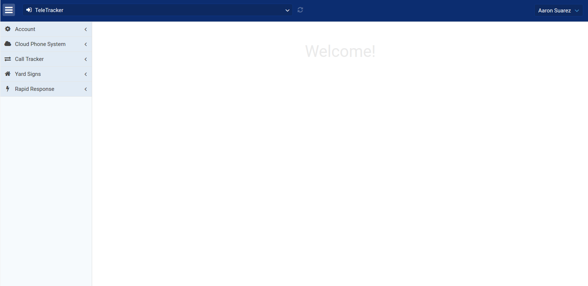
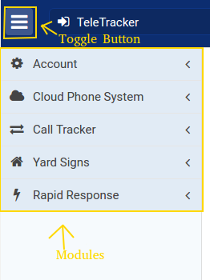
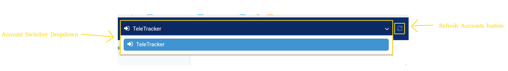
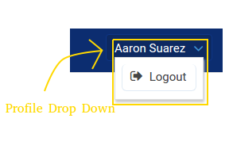

# TeleTracker Client Area User Documentation

This document provides instructions on how to use the TeleTracker Client Area, including explanations of what each module does. Each component and configuration option is explored in detail.

## Table of Contents

- [Home Screen](#home-screen)
- [Account Module](#account-module)
- [Cloud Phone System Module](#cloud-phone-system-module)
- [Call Tracker Module](#call-tracker-module)
- [Yard Signs Module](#yard-signs-module)
- [Rapid Response Module](#rapid-response-module)

Lorem ipsum dolor sit amet, consectetur adipiscing elit. Pellentesque hendrerit facilisis dolor, sed convallis massa tincidunt nec. Praesent aliquam tortor in ipsum mattis, a iaculis metus blandit. Vestibulum et feugiat leo, at aliquet orci. Nullam consequat ante nulla, vel blandit orci dignissim ut. In quis dignissim ante, nec efficitur quam. Aenean neque lacus, efficitur ultricies nulla in, fermentum mollis enim. Mauris sed eros vel felis volutpat tempor. Aenean ornare urna quis massa mattis, eu porttitor neque feugiat. Aenean a risus a risus fringilla eleifend id ac urna. Duis non ante sit amet sem iaculis vulputate hendrerit a purus. Mauris ut quam a orci gravida feugiat. Donec sed malesuada leo. Curabitur tempus auctor lectus at finibus. Aenean ultrices suscipit sapien, in placerat arcu vestibulum vulputate.

Morbi ut imperdiet dolor. Cras convallis sapien augue, at facilisis tellus dictum eget. Pellentesque ut quam sollicitudin, bibendum leo ac, finibus est. Cras maximus neque arcu, nec efficitur ipsum luctus ac. Pellentesque auctor luctus risus, ut condimentum sem semper et. Aenean pulvinar urna dolor, commodo dignissim sem egestas id. Nulla facilisi. Nam facilisis et nunc a luctus. Cras et placerat diam.

Vestibulum ante ipsum primis in faucibus orci luctus et ultrices posuere cubilia Curae; Quisque dolor odio, pretium id ligula in, porta dictum mauris. Vivamus pretium mollis mauris eleifend consequat. Aenean justo urna, consectetur id elementum vel, laoreet tempor lectus. Vestibulum sed augue eget odio congue tincidunt. Sed auctor metus eget laoreet aliquet. Donec luctus scelerisque urna, vel lobortis nulla lobortis tincidunt. Fusce cursus ut magna non tincidunt.

## Home Screen

The Home Screen is composed of three main components:

* Navigation Menu
* Account Switcher
* Profile Menu

### Navigation Menu

The navigation menu on the left is composed of the toggle button (for showing and hiding the menu) and a list of modules. Each module is discussed in detail below. The modules that are displayed depend on the access level of the user as well as how the account is set up. For example, Yard Signs are not relevant for all accounts, and therefore the Yard Sign Module is not displayed for those accounts.

### Account Switcher

The account switcher is a drop down menu of all the accounts associated with the currently logged in user. If the user only has one account (as in the image above), only the one account is displayed. The refresh button to the right of the dropdown refreshes the available accounts.

### Profile Menu

The profile menu is a dropdown that allows the user to logout. More options for personal settings coming soon!

## Account Module

Lorem ipsum dolor sit amet, consectetur adipiscing elit. Pellentesque hendrerit facilisis dolor, sed convallis massa tincidunt nec. Praesent aliquam tortor in ipsum mattis, a iaculis metus blandit. Vestibulum et feugiat leo, at aliquet orci. Nullam consequat ante nulla, vel blandit orci dignissim ut. In quis dignissim ante, nec efficitur quam. Aenean neque lacus, efficitur ultricies nulla in, fermentum mollis enim. Mauris sed eros vel felis volutpat tempor. Aenean ornare urna quis massa mattis, eu porttitor neque feugiat. Aenean a risus a risus fringilla eleifend id ac urna. Duis non ante sit amet sem iaculis vulputate hendrerit a purus. Mauris ut quam a orci gravida feugiat. Donec sed malesuada leo. Curabitur tempus auctor lectus at finibus. Aenean ultrices suscipit sapien, in placerat arcu vestibulum vulputate.

Morbi ut imperdiet dolor. Cras convallis sapien augue, at facilisis tellus dictum eget. Pellentesque ut quam sollicitudin, bibendum leo ac, finibus est. Cras maximus neque arcu, nec efficitur ipsum luctus ac. Pellentesque auctor luctus risus, ut condimentum sem semper et. Aenean pulvinar urna dolor, commodo dignissim sem egestas id. Nulla facilisi. Nam facilisis et nunc a luctus. Cras et placerat diam.

Vestibulum ante ipsum primis in faucibus orci luctus et ultrices posuere cubilia Curae; Quisque dolor odio, pretium id ligula in, porta dictum mauris. Vivamus pretium mollis mauris eleifend consequat. Aenean justo urna, consectetur id elementum vel, laoreet tempor lectus. Vestibulum sed augue eget odio congue tincidunt. Sed auctor metus eget laoreet aliquet. Donec luctus scelerisque urna, vel lobortis nulla lobortis tincidunt. Fusce cursus ut magna non tincidunt.

## Cloud Phone System Module

Lorem ipsum dolor sit amet, consectetur adipiscing elit. Pellentesque hendrerit facilisis dolor, sed convallis massa tincidunt nec. Praesent aliquam tortor in ipsum mattis, a iaculis metus blandit. Vestibulum et feugiat leo, at aliquet orci. Nullam consequat ante nulla, vel blandit orci dignissim ut. In quis dignissim ante, nec efficitur quam. Aenean neque lacus, efficitur ultricies nulla in, fermentum mollis enim. Mauris sed eros vel felis volutpat tempor. Aenean ornare urna quis massa mattis, eu porttitor neque feugiat. Aenean a risus a risus fringilla eleifend id ac urna. Duis non ante sit amet sem iaculis vulputate hendrerit a purus. Mauris ut quam a orci gravida feugiat. Donec sed malesuada leo. Curabitur tempus auctor lectus at finibus. Aenean ultrices suscipit sapien, in placerat arcu vestibulum vulputate.

Morbi ut imperdiet dolor. Cras convallis sapien augue, at facilisis tellus dictum eget. Pellentesque ut quam sollicitudin, bibendum leo ac, finibus est. Cras maximus neque arcu, nec efficitur ipsum luctus ac. Pellentesque auctor luctus risus, ut condimentum sem semper et. Aenean pulvinar urna dolor, commodo dignissim sem egestas id. Nulla facilisi. Nam facilisis et nunc a luctus. Cras et placerat diam.

Vestibulum ante ipsum primis in faucibus orci luctus et ultrices posuere cubilia Curae; Quisque dolor odio, pretium id ligula in, porta dictum mauris. Vivamus pretium mollis mauris eleifend consequat. Aenean justo urna, consectetur id elementum vel, laoreet tempor lectus. Vestibulum sed augue eget odio congue tincidunt. Sed auctor metus eget laoreet aliquet. Donec luctus scelerisque urna, vel lobortis nulla lobortis tincidunt. Fusce cursus ut magna non tincidunt.

## Call Tracker Module

Lorem ipsum dolor sit amet, consectetur adipiscing elit. Pellentesque hendrerit facilisis dolor, sed convallis massa tincidunt nec. Praesent aliquam tortor in ipsum mattis, a iaculis metus blandit. Vestibulum et feugiat leo, at aliquet orci. Nullam consequat ante nulla, vel blandit orci dignissim ut. In quis dignissim ante, nec efficitur quam. Aenean neque lacus, efficitur ultricies nulla in, fermentum mollis enim. Mauris sed eros vel felis volutpat tempor. Aenean ornare urna quis massa mattis, eu porttitor neque feugiat. Aenean a risus a risus fringilla eleifend id ac urna. Duis non ante sit amet sem iaculis vulputate hendrerit a purus. Mauris ut quam a orci gravida feugiat. Donec sed malesuada leo. Curabitur tempus auctor lectus at finibus. Aenean ultrices suscipit sapien, in placerat arcu vestibulum vulputate.

Morbi ut imperdiet dolor. Cras convallis sapien augue, at facilisis tellus dictum eget. Pellentesque ut quam sollicitudin, bibendum leo ac, finibus est. Cras maximus neque arcu, nec efficitur ipsum luctus ac. Pellentesque auctor luctus risus, ut condimentum sem semper et. Aenean pulvinar urna dolor, commodo dignissim sem egestas id. Nulla facilisi. Nam facilisis et nunc a luctus. Cras et placerat diam.

Vestibulum ante ipsum primis in faucibus orci luctus et ultrices posuere cubilia Curae; Quisque dolor odio, pretium id ligula in, porta dictum mauris. Vivamus pretium mollis mauris eleifend consequat. Aenean justo urna, consectetur id elementum vel, laoreet tempor lectus. Vestibulum sed augue eget odio congue tincidunt. Sed auctor metus eget laoreet aliquet. Donec luctus scelerisque urna, vel lobortis nulla lobortis tincidunt. Fusce cursus ut magna non tincidunt.

## Yard Signs Module

Lorem ipsum dolor sit amet, consectetur adipiscing elit. Pellentesque hendrerit facilisis dolor, sed convallis massa tincidunt nec. Praesent aliquam tortor in ipsum mattis, a iaculis metus blandit. Vestibulum et feugiat leo, at aliquet orci. Nullam consequat ante nulla, vel blandit orci dignissim ut. In quis dignissim ante, nec efficitur quam. Aenean neque lacus, efficitur ultricies nulla in, fermentum mollis enim. Mauris sed eros vel felis volutpat tempor. Aenean ornare urna quis massa mattis, eu porttitor neque feugiat. Aenean a risus a risus fringilla eleifend id ac urna. Duis non ante sit amet sem iaculis vulputate hendrerit a purus. Mauris ut quam a orci gravida feugiat. Donec sed malesuada leo. Curabitur tempus auctor lectus at finibus. Aenean ultrices suscipit sapien, in placerat arcu vestibulum vulputate.

Morbi ut imperdiet dolor. Cras convallis sapien augue, at facilisis tellus dictum eget. Pellentesque ut quam sollicitudin, bibendum leo ac, finibus est. Cras maximus neque arcu, nec efficitur ipsum luctus ac. Pellentesque auctor luctus risus, ut condimentum sem semper et. Aenean pulvinar urna dolor, commodo dignissim sem egestas id. Nulla facilisi. Nam facilisis et nunc a luctus. Cras et placerat diam.

Vestibulum ante ipsum primis in faucibus orci luctus et ultrices posuere cubilia Curae; Quisque dolor odio, pretium id ligula in, porta dictum mauris. Vivamus pretium mollis mauris eleifend consequat. Aenean justo urna, consectetur id elementum vel, laoreet tempor lectus. Vestibulum sed augue eget odio congue tincidunt. Sed auctor metus eget laoreet aliquet. Donec luctus scelerisque urna, vel lobortis nulla lobortis tincidunt. Fusce cursus ut magna non tincidunt.

## Rapid Response Module

Lorem ipsum dolor sit amet, consectetur adipiscing elit. Pellentesque hendrerit facilisis dolor, sed convallis massa tincidunt nec. Praesent aliquam tortor in ipsum mattis, a iaculis metus blandit. Vestibulum et feugiat leo, at aliquet orci. Nullam consequat ante nulla, vel blandit orci dignissim ut. In quis dignissim ante, nec efficitur quam. Aenean neque lacus, efficitur ultricies nulla in, fermentum mollis enim. Mauris sed eros vel felis volutpat tempor. Aenean ornare urna quis massa mattis, eu porttitor neque feugiat. Aenean a risus a risus fringilla eleifend id ac urna. Duis non ante sit amet sem iaculis vulputate hendrerit a purus. Mauris ut quam a orci gravida feugiat. Donec sed malesuada leo. Curabitur tempus auctor lectus at finibus. Aenean ultrices suscipit sapien, in placerat arcu vestibulum vulputate.

Morbi ut imperdiet dolor. Cras convallis sapien augue, at facilisis tellus dictum eget. Pellentesque ut quam sollicitudin, bibendum leo ac, finibus est. Cras maximus neque arcu, nec efficitur ipsum luctus ac. Pellentesque auctor luctus risus, ut condimentum sem semper et. Aenean pulvinar urna dolor, commodo dignissim sem egestas id. Nulla facilisi. Nam facilisis et nunc a luctus. Cras et placerat diam.

Vestibulum ante ipsum primis in faucibus orci luctus et ultrices posuere cubilia Curae; Quisque dolor odio, pretium id ligula in, porta dictum mauris. Vivamus pretium mollis mauris eleifend consequat. Aenean justo urna, consectetur id elementum vel, laoreet tempor lectus. Vestibulum sed augue eget odio congue tincidunt. Sed auctor metus eget laoreet aliquet. Donec luctus scelerisque urna, vel lobortis nulla lobortis tincidunt. Fusce cursus ut magna non tincidunt.
